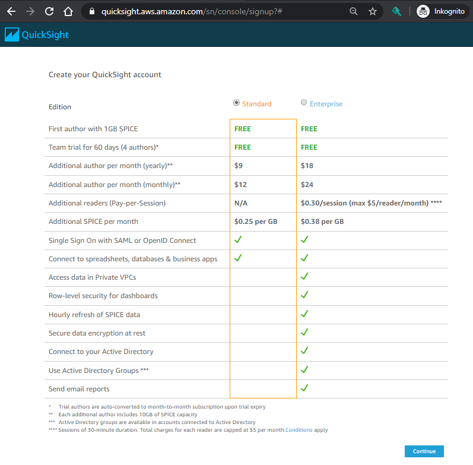

# AWS Cost Explorer Alternative with AWS Quicksight
The following solution will enable you to explore your **basic** AWS spending in Amazon QuickSight. Only the plain AWS usage will be shown in the dashboards. Tax will be excluded and the currency is in USD.


> Please keep in mind that this solution does not aim to reproduce all the 
> possibilities that the `AWS Cost Explorer` has. It also doesn't have all the 
> capabilities commercial 3rd party tools like CloudCheckr have. The main goal is to give a basic functionality to see the cost.


## What will it cost?
If you will use QuickSight only with one user, QuickSight will be free of charge. Additional users/authors cost 9$/month as of May 2020. See also the [Amazon QuicSight pricing website](https://aws.amazon.com/quicksight/pricing) 

## Activate Quicksight in your AWS account
1. Login into your AWS account
1. Choose the `Quicksight` Service in the AWS console or navigate to `https://eu-central-1.quicksight.aws.amazon.com/sn/start`.

1. Click on `Sign up for QuickSight` and choose then the `Standard` Edition. This is sufficiant for this use-case.


1. Complete the Quicksight account creation process by choosing the `Frankfurt` region, selecting S3 integration and providing an **arbitrary self-chosen** account name and an admin E-Mail address. Click on `Choose S3 bucket` and choose the bucket `quicksight-data-<YOUR_ACCOUNT_ID>`.


1. After the account got created you will see a `Congratulations` message. Click on `Go to Amazon QuickSight` Button to launch QuickSight


1. Click on `Manage Data` and then on `New Data Set`. In the following screen click on `S3`


1. In the following two steps we will create multiple data sources with different data drill-downs. The following table gives an overview of the different data sources which can be used within QuickSight:

| Data Source Type         |     Description      |
|--------------------------|-------------|
| group_by_usage_type      |  drill-down by the detailed usage type (e.g. VPCEndpoint running cost, EBS volumes etc.) |
| group_by_tag_environment | group usage by the resource tag `environment`   |
| group_by_instance_type   | group by Instance Type (e.g. m5.large, db.t3.large etc.) |


So let's get started - Give an **arbitrary self-chosen** name in the `Data source name` field and paste the URL 

```
https://quicksight-data-<YOUR_ACCOUNT_ID>.s3.eu-central-1.amazonaws.com/cost_and_usage/<GROUP_TYPE>/manifest.json
``` 
Please exchange:

* `<YOUR_ACCOUNT_ID>` with your 12 digit account number
* `<GROUP_TYPE>` with `group_by_usage_type` and then **repeat the steps 7 and 8** by providing `<GROUP_TYPE>` with `group_by_tag_environment` and `group_by_instance_type`


8. After clicking on `Connect` the import will be processed. In the following sreen click on `Visualize` to create a new Quicksight analysis


9. If you then see the data, click on the selections as depicted in the below figure to get the first diagram.

Next you will see the usage on a daily basis. If you don't see the date please refresh the browser window. 

You can now aggragate the time by month

And if you want to group the usage by service, just drap&drop the `service` field into the dashboard center

Change the visualization type as depicted in the below figure and move your mouse over the colored columns.


10. To continously refresh the data please click on the QuickSight Logo on the upper left corner to get to the homepage. Then click on  `Manage Data` and then on your newely created Data Set. In the next pop-up window click on `Schedule refresh`

Follow the wizard and leave all settings to default


> The data will be pushed into your account every 6 hours. You could also create multiple schedules on QuickSight side to have also refreshed data within a day.


## Invite new users to QuickSight
To invite new users, please follow the below step by step instruction


## Tips
* There are mobile Apps in the iOS App Store and Android Play Store. To you it, you need a non-IAM user with email and passwort only. Create/Invite this user by email following the guidance above.

* If you want to integrate QuickSight with other services than S3 or connect to other buckets, our can manage this access through the `security & permissions` menu as shown in the below figure.

* E-Mail notification is only available in the `Enterprise Edition` as stated [here](https://aws.amazon.com/blogs/big-data/amazon-quicksight-now-supports-email-reports-and-data-labels/)