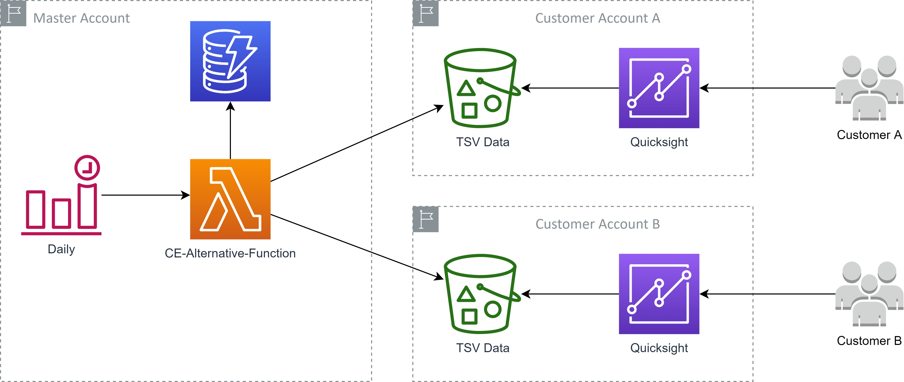
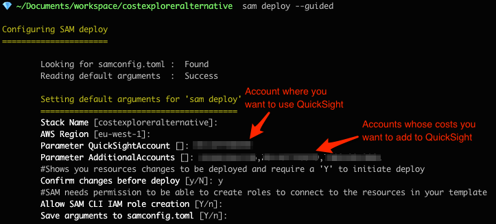
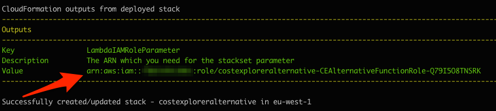

# Cost Explorer Alternative with AWS Quicksight


## Usage
* Sign in into your AWS master account with admin permissions
* Execute following SAM commands to build and deploy the cft
    ```
    sam build
    sam deploy --guided
    ```
        
* Get the output value `LambdaIAMRoleParameter` as show here

* Replace the placeholder `<ROLE_ARN>` in the following command with the value of the previous step and execute it 
```
ROLE_ARN=<ROLE_ARN>
aws cloudformation create-stack-set \
    --stack-set-name quicksight-data \
    --template-body file://stackset_cft.yml \
    --permission-model SERVICE_MANAGED \
    --capabilities CAPABILITY_IAM \
    --auto-deployment Enabled=true,RetainStacksOnAccountRemoval=true \
    --parameters ParameterKey=LambdaIAMRoleParameter,ParameterValue=$ROLE_ARN \
    --description "Create QuickSight Buckets in all linked account"
```
Now provide your OUs where you want to create the buckets for QuickSight data
```
ORG_UNITS=<ORG_UNITS>
aws cloudformation create-stack-instances \
    --stack-set-name quicksight-data \
    --deployment-targets OrganizationalUnitIds=$ORG_UNITS \
    --regions eu-west-1
```


## Using Quicksight in the linked account
Read the document [Getting Started Linked Account](./GettingStartedLinkedAccount.md)

